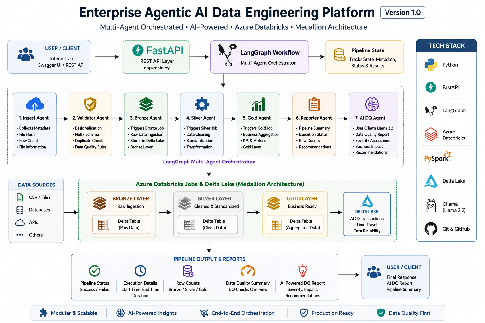

# 🚀 Enterprise Agentic AI Data Engineering Platform


[](https://www.python.org/)
[](https://fastapi.tiangolo.com/)
[](https://www.langchain.com/langgraph)
[](https://www.databricks.com/)
[](https://spark.apache.org/docs/latest/api/python/)
[](https://delta.io/)
[](https://ollama.com/)
[](https://github.com/salmanjpathan)
[](LICENSE)

> **Enterprise AI-powered Data Engineering Platform built with Azure Databricks, LangGraph, FastAPI, PySpark, Delta Lake, and Ollama (Llama 3.2).**

> An enterprise-style AI-powered Data Engineering platform that orchestrates end-to-end data pipelines using **LangGraph**, **Azure Databricks**, **FastAPI**, **PySpark**, and **Delta Lake**.

The platform follows the **Medallion Architecture (Bronze → Silver → Gold)** and leverages **AI-powered Data Quality Analysis** using **Ollama (Llama 3.2)**.

---

## ✨ Features

- 🤖 Multi-Agent Orchestration using LangGraph
- ⚡ Azure Databricks Job Automation
- 🥉 Bronze Layer Data Ingestion
- 🥈 Silver Layer Data Cleaning & Transformation
- 🥇 Gold Layer Business Aggregation
- 📊 Delta Lake Storage
- 🧠 AI-powered Data Quality Report using Ollama (Llama 3.2)
- 🌐 REST APIs using FastAPI
- 📋 Pipeline Execution Reporting
- 🔄 Modular & Scalable Architecture

---


## 🏗️ Architecture

<p align="center">
  
</p>

The platform orchestrates an end-to-end AI-powered data engineering workflow using FastAPI, LangGraph, Azure Databricks, Delta Lake, and Ollama (Llama 3.2).

---

# 🛠️ Tech Stack

| Category | Technology |
|----------|------------|
| Language | Python |
| Framework | FastAPI |
| AI Framework | LangGraph |
| LLM | Ollama (Llama 3.2) |
| Data Processing | PySpark |
| Data Platform | Azure Databricks |
| Storage | Delta Lake |
| APIs | FastAPI |
| Version Control | Git & GitHub |

---

# 📂 Project Structure

```text
AI-Powered-Multi-Agent-Data-Pipeline-Orchestrator
│
├── app
│   ├── agents
│   ├── api
│   ├── databricks
│   ├── graph
│   ├── llm
│   ├── schemas
│   ├── services
│   ├── utils
│   └── main.py
│
├── data
│   └── raw
│
├── requirements.txt
├── README.md
└── .gitignore
```

---

# 🤖 AI Agents

### 📥 Ingest Agent

- Collects metadata
- Calculates file hash
- Tracks dataset information

---

### 🥉 Bronze Agent

Triggers the Bronze Databricks Job.

Responsibilities

- Raw Data Ingestion
- Bronze Delta Table Creation

---

### ✅ Validator Agent

Performs initial dataset validation before processing.

Current validation includes

- Dataset verification
- Basic quality checks

---

### 🥈 Silver Agent

Triggers the Silver Databricks Job.

Responsibilities

- Data Cleaning
- Standardization
- Transformation

---

### 🥇 Gold Agent

Triggers the Gold Databricks Job.

Responsibilities

- Business Aggregations
- Analytics-ready Data
- KPI Generation

---

### 📋 Reporter Agent

Creates pipeline execution summary.

Includes

- Pipeline Status
- Execution Time
- Recommendations

---

### 🤖 AI Data Quality Agent

Uses **Ollama (Llama 3.2)** to generate AI-powered Data Quality insights.

Generates

- Data Quality Summary
- Severity Assessment
- Business Impact
- Recommendations

---

# 📊 Medallion Architecture

```text
Raw Dataset
      │
      ▼
 Bronze Layer
      │
      ▼
 Silver Layer
      │
      ▼
 Gold Layer
```

---

# 🚀 API Endpoints

## Run FastAPI

```bash
uvicorn app.main:app --reload
```

Open Swagger

```text
http://127.0.0.1:8000/docs
```

Available APIs

| Method | Endpoint | Description |
|--------|----------|-------------|
| GET | /health | Health Check |
| POST | /run-pipeline | Execute Complete Pipeline |

---

# ⚙️ Pipeline Workflow

```text
Ingest
   │
Bronze
   │
Validate
   │
Silver
   │
Gold
   │
Reporter
   │
AI Data Quality
```

---

# 📷 Screenshots

> Screenshots will be added in the next release.

Planned screenshots

- FastAPI Swagger UI
- Databricks Jobs
- Bronze Layer
- Silver Layer
- Gold Layer
- AI Data Quality Report

---

# 📦 Dataset

This project uses the **DataCo Smart Supply Chain Dataset**.

Download it from Kaggle and place it in:

```text
data/raw/DataCoSupplyChainDataset.csv
```

The dataset is excluded from GitHub because of its size.

---

# 🔮 Roadmap

## ✅ Version 1.0

- FastAPI
- LangGraph
- Azure Databricks Integration
- Bronze Layer
- Silver Layer
- Gold Layer
- AI Data Quality Report

### 🚧 Upcoming Features

- Databricks-based Validation
- Metadata Logging
- Audit Tables
- AI Root Cause Analysis
- Business Insights Agent
- Streamlit Dashboard
- GitHub Actions CI/CD
- Notification System

---

# 💻 Installation

Clone the repository

```bash
git clone https://github.com/salmanjpathan/AI-Powered-Multi-Agent-Data-Pipeline-Orchestrator.git
```

Navigate to the project

```bash
cd AI-Powered-Multi-Agent-Data-Pipeline-Orchestrator
```

Install dependencies

```bash
pip install -r requirements.txt
```

Run the application

```bash
uvicorn app.main:app --reload
```

---

# 👨‍💻 Author

**Salman Pathan**

Azure Data Engineer | Databricks | PySpark | FastAPI | LangGraph | AI Engineering

GitHub

https://github.com/salmanjpathan

---

# 📄 License

This project is licensed under the MIT License.

---

# ⭐ Support

If you found this project useful, consider giving it a ⭐ on GitHub.